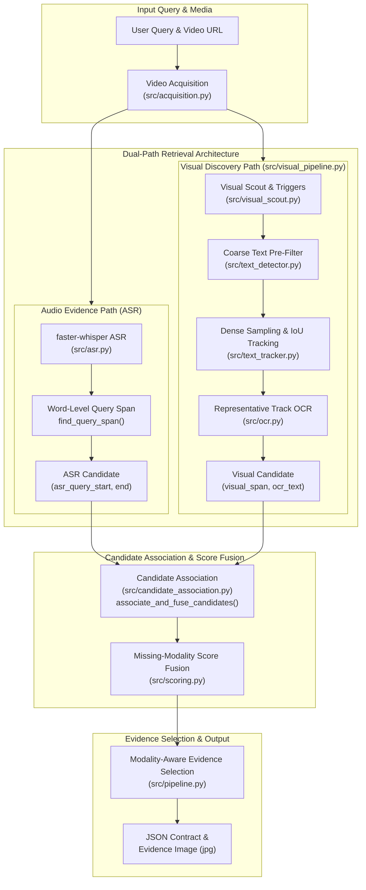
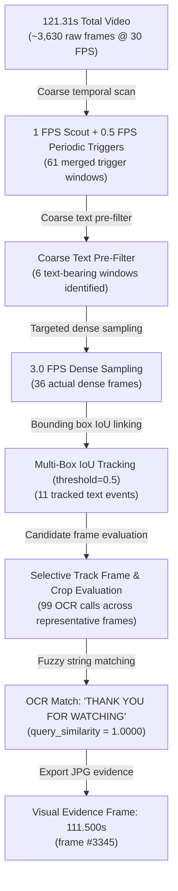

# Dual-Path Video Dialogue Locator (v1.0.0)

A **production-oriented multimodal video retrieval baseline** that locates dialogue occurrences in video content from either **spoken audio** or **burned-in visual text** (on-screen subtitles, title cards, dynamic captions), returning exact match timestamps and visual evidence frames.

---

## 🌟 Executive Overview

Video Dialogue Locator combines Automatic Speech Recognition (ASR) with Computer Vision and Optical Character Recognition (OCR) into a **Dual-Path Retrieval Architecture**.

### Supported Modality Modes:
1. **Multimodal Match (ASR + OCR)**: Dialogue occurs in spoken speech **and** appears as on-screen text (e.g. Case 5). Returns `sources = ["asr", "ocr"]` and exports the visual OCR frame (`15.347s`) as evidence.
2. **Visual-Only Match (OCR-Only)**: Dialogue appears as silent visual text or dynamic title card without spoken audio (e.g. Case 3). Returns `sources = ["ocr"]` and exports the visual OCR frame (`111.500s`) as evidence.
3. **Spoken-Only Match (ASR-Only)**: Dialogue is spoken aloud without on-screen text (e.g. Case 1). Returns `sources = ["asr"]` and exports the frame corresponding to the spoken query span (`87.660s`).
4. **Negative Case (`NOT_FOUND`)**: Neither speech nor on-screen text matches the query (e.g. Cases 6 & 7). Returns `status = "NOT_FOUND"`, `results = []`.

> [!NOTE]
> **Active Modalities**: Active scoring modalities in v1.0.0 are `asr` and `ocr`. The `scores.semantic` field is a schema interface parameter reserved for future semantic vector search extensions (returns `null` in v1.0.0).

---

## 🏗️ High-Level Architecture



For authoritative, deep technical architecture documentation, stage flows, and Case 3/5/6 walkthroughs, see [docs/ARCHITECTURE.md](docs/ARCHITECTURE.md).

---

## ⚡ Progressive Visual Search Reduction Strategy

To avoid executing expensive CPU text recognition on thousands of video frames, the visual discovery path applies a **Progressive Visual Search Reduction** policy:



---

## 📁 Source Modules & Stage Mapping

| Source File | Module Responsibility | Logical Pipeline Stage |
|---|---|---|
| [src/pipeline.py](src/pipeline.py) | Master Orchestrator | Coordinates Stage 1 Acquisition through Stage 5 Result Serialization. |
| [src/acquisition.py](src/acquisition.py) | Media Acquisition | Stage 1: Downloads video via `yt-dlp` and inspects OpenCV metadata. |
| [src/asr.py](src/asr.py) | Audio Evidence Path | Stage 2: Transcribes audio with `faster-whisper` and extracts word-level query spans (`find_query_span`). |
| [src/visual_pipeline.py](src/visual_pipeline.py) | Visual Discovery Orchestration | Stage 3: Orchestrates scout triggers, text-bearing filtering, dense sampling, tracking, and selective OCR. |
| [src/visual_scout.py](src/visual_scout.py) | Visual Change Scout | Computes frame difference triggers (1 FPS) and periodic safety triggers (0.5 FPS). |
| [src/text_detector.py](src/text_detector.py) | Text Detection | Coarse text pre-filtering and dense frame bounding box detection via RapidOCR. |
| [src/text_tracker.py](src/text_tracker.py) | IoU Text Tracker | Groups detected bounding boxes across consecutive frames into continuous `TextEvent` tracks. |
| [src/ocr.py](src/ocr.py) | OCR Recognition | Evaluates text recognition on cropped candidate bounding boxes. |
| [src/candidate_association.py](src/candidate_association.py) | Association & Fusion | Stage 4: `associate_and_fuse_candidates` merges ASR query spans with visual tracks (`5.0s` window). |
| [src/matching.py](src/matching.py) | Text Matching | Fuzzy phrase ratio and token coverage similarity for ASR and OCR text. |
| [src/scoring.py](src/scoring.py) | Score Fusion | Normalized missing-modality score fusion (`fuse_scores`). |
| [src/models.py](src/models.py) | Data Models | Central dataclasses (`Candidate`, `ASRQuerySpan`, `VisualTrackSpan`, `EvidenceMetadata`, `SearchStats`). |

---

## 🏆 Golden Test Benchmark Summary

The evaluation suite contains **7 Golden Test Cases** benchmarked against real YouTube video content:

| Case | Video Link | Target Query | Ground Truth | Speech Match | Visual Text Match | Sources | Status | Evidence Timestamp |
|:---:|---|---|---|:---:|:---:|:---:|:---:|:---:|
| **Case 1** | [YVvD7SZ7kc0](https://www.youtube.com/watch?v=YVvD7SZ7kc0) | `"Why Do We Fall?"` | Spoken Only | True | False | `["asr"]` | `FOUND` | `87.660s` (ASR Query Span) |
| **Case 2** | [YVvD7SZ7kc0](https://www.youtube.com/watch?v=YVvD7SZ7kc0) | `"so that we can learn to pick ourselves"` | Spoken Only | True | False | `["asr"]` | `FOUND` | `92.740s` (ASR Query Span) |
| **Case 3** | [YVvD7SZ7kc0](https://www.youtube.com/watch?v=YVvD7SZ7kc0) | `"Thank you for watching"` | **Silent Visual Text** | False | True | `["ocr"]` | `FOUND` | `111.500s` (Visual OCR Frame) |
| **Case 4** | [YVvD7SZ7kc0](https://www.youtube.com/watch?v=YVvD7SZ7kc0) | `"have you quite given up on me?"` | Spoken Only | True | False | `["asr"]` | `FOUND` | `18.000s` (ASR Query Span) |
| **Case 5** | [WZORRHNP9_w](https://www.youtube.com/shorts/WZORRHNP9_w) | `"At least tell me your name"` | **Spoken + Visual** | True | True | `["asr", "ocr"]` | `FOUND` | `15.347s` (Visual OCR Frame) |
| **Case 6** | [WZORRHNP9_w](https://www.youtube.com/shorts/WZORRHNP9_w) | `"Batman"` | Neither | False | False | `[]` | `NOT_FOUND` | None |
| **Case 7** | [WZORRHNP9_w](https://www.youtube.com/shorts/WZORRHNP9_w) | `"The blue elephant is dancing"` | Neither | False | False | `[]` | `NOT_FOUND` | None |

For execution instructions and full case details, see [docs/TESTING.md](docs/TESTING.md).

---

## 🚀 Quick Start & CLI Commands

### 1. Installation
```bash
python -m venv .venv
.\.venv\Scripts\activate
pip install -r requirements.txt
```

### 2. Automated Test Suite
Run the 36 unit tests across 11 modules:
```powershell
.\.venv\Scripts\pytest.exe tests/
```

### 3. Canonical Benchmark Suite Runner
Run all 7 Golden Test Cases and generate complete evaluation artifacts:
```powershell
.\.venv\Scripts\python.exe scripts/run_golden_suite.py
```

### 4. Run Single Golden Case
```powershell
.\.venv\Scripts\python.exe scripts/execute_single_case.py 5
```

---

## 🗺️ Engineering Roadmap & Strategy

The `v1.0.0` release represents a deliberately scoped correctness baseline. Future evolution, technical priorities, scaling pathways, and engineering defenses are documented in:

👉 **[docs/ENGINEERING_ROADMAP.md](docs/ENGINEERING_ROADMAP.md)**

---

## 🛠️ Baseline Release Information

- **Release Baseline**: Production-oriented v1.0.0 correctness baseline
- **Version**: `v1.0.0`
- **Git Tag**: `v1.0.0`
- **Git Commit**: `e2967a3`

