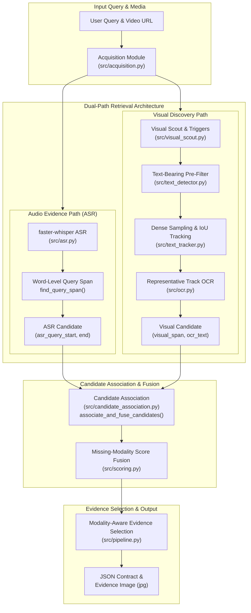
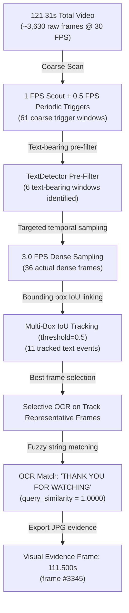

# Dual-Path Video Dialogue Locator (v1.0.0)

A production-grade, multi-modal video search system that locates dialogue occurrences in video content from either **spoken audio** or **burned-in visual text** (on-screen subtitles, title cards, dynamic captions), returning exact match timestamps and visual evidence frames.

---

## 🌟 Executive Overview

Video Dialogue Locator combines Automatic Speech Recognition (ASR) with Computer Vision and Optical Character Recognition (OCR) into a **Dual-Path Retrieval Architecture**.

### Supported Modality Modes:
1. **Multimodal Match (ASR + OCR)**: Dialogue occurs in spoken speech **and** appears as on-screen text (e.g. Case 5). Returns `sources = ["asr", "ocr"]` and exports the visual OCR frame as evidence.
2. **Visual-Only Match (OCR-Only)**: Dialogue appears as silent visual text or dynamic title card without spoken audio (e.g. Case 3). Returns `sources = ["ocr"]` and exports the visual OCR frame as evidence.
3. **Spoken-Only Match (ASR-Only)**: Dialogue is spoken aloud without on-screen text (e.g. Case 1). Returns `sources = ["asr"]` and exports the frame corresponding to the spoken query span.
4. **Negative Case (`NOT_FOUND`)**: Neither speech nor on-screen text matches the query (e.g. Case 6). Returns `status = "NOT_FOUND"`, `results = []`.

---

## 🏗️ High-Level Architecture



For detailed architectural diagrams and stage breakdown, see [docs/ARCHITECTURE.md](docs/ARCHITECTURE.md).

---

## ⚡ Staged Visual Reduction Strategy (Search Funnel)

To avoid executing expensive CPU text detection on thousands of video frames, the visual discovery path applies a 5-stage reduction policy:



---

## 📁 Source Code Map

| File Path | Component | Responsibility |
|---|---|---|
| [src/pipeline.py](src/pipeline.py) | Orchestrator | Main entry point (`locate_dialogue_in_video`) coordinating acquisition, ASR, visual discovery, association, and JSON formatting. |
| [src/asr.py](src/asr.py) | Audio Evidence | Transcribes audio with `faster-whisper` and extracts word-level query spans (`find_query_span`). |
| [src/visual_pipeline.py](src/visual_pipeline.py) | Visual Discovery | Orchestrates change scouting, text-bearing filtering, dense sampling, tracking, and representative frame OCR. |
| [src/candidate_association.py](src/candidate_association.py) | Fusion & Association | `associate_and_fuse_candidates`: Merges ASR query spans with visual tracks using temporal windowing (`5.0s`) and OCR thresholds (`0.45`). |
| [src/text_detector.py](src/text_detector.py) | Text Detection | Uses RapidOCR ONNX model to extract text bounding boxes from frames. |
| [src/text_tracker.py](src/text_tracker.py) | IoU Tracker | Tracks text bounding boxes across consecutive frames using IoU tracking. |
| [src/ocr.py](src/ocr.py) | OCR Recognition | Evaluates text recognition on candidate frame crops using RapidOCR. |
| [src/matching.py](src/matching.py) | Text Matching | Fuzzy phrase ratio and token coverage similarity for ASR and OCR text. |
| [src/scoring.py](src/scoring.py) | Score Fusion | Score normalization and missing-modality score fusion (`fuse_scores`). |
| [src/acquisition.py](src/acquisition.py) | Video Download | Downloads video via `yt-dlp` and inspects OpenCV video metadata. |
| [src/models.py](src/models.py) | Data Models | Central dataclasses (`Candidate`, `ASRQuerySpan`, `VisualTrackSpan`, `EvidenceMetadata`, `SearchStats`). |
| [run.py](run.py) | CLI Entry Point | Command-line interface for running dialogue queries. |

---

## ⚙️ Configuration Reference

| Parameter Key | `config.yaml` Value | `config.dev.yaml` Value | Description |
|---|---|---|---|
| `asr.model` | `"base"` | `"tiny"` | Whisper model size (`"base"` for production, `"tiny"` for fast dev). |
| `asr.candidate_threshold` | `0.50` | `0.50` | Minimum similarity score required to accept ASR candidate. |
| `sampling.coarse_fps` | `1.0` | `1.0` | FPS for coarse change scout sampling. |
| `sampling.dense_fps` | `3.0` | `2.0` | FPS for dense text detection sampling within text-bearing windows. |
| `visual_scout.periodic_detection_fps` | `0.5` | `0.2` | Safety interval (FPS) for periodic text triggers. |
| `visual_scout.trigger_merge_window` | `2.0` | `3.0` | Window (seconds) for merging adjacent scout triggers into clips. |
| `matching.ocr_min_threshold` | `0.45` | `0.45` | Minimum OCR similarity required for candidate association. |
| `matching.similarity_threshold` | `0.75` | `0.75` | Threshold for candidate score filtering. |

For the complete parameter specification table, see [docs/CONFIGURATION.md](docs/CONFIGURATION.md).

---

## 🧪 Automated Testing & Benchmark Evaluation

### Unit Test Suite
The automated test suite contains **36 unit tests** covering all modules:
```powershell
.\.venv\Scripts\pytest.exe tests/
```

### Golden Benchmark Evaluation Suite

The evaluation benchmark contains **7 Golden Test Cases** covering spoken dialogue, silent visual text, multimodal confirmation, and negative controls.

#### Golden Test Benchmark Summary Matrix

| Case | Video Link | Target Query | Ground Truth | Speech Match | Visual Text Match | Sources | Status | Expected Evidence Timestamp |
|:---:|---|---|---|:---:|:---:|:---:|:---:|:---:|
| **Case 1** | [YVvD7SZ7kc0](https://www.youtube.com/watch?v=YVvD7SZ7kc0) | `"Why Do We Fall?"` | Spoken Only | True | False | `["asr"]` | `FOUND` | `1.50s` (ASR Query Span) |
| **Case 2** | [YVvD7SZ7kc0](https://www.youtube.com/watch?v=YVvD7SZ7kc0) | `"so that we can learn to pick ourselves"` | Spoken Only | True | False | `["asr"]` | `FOUND` | `9.90s` (ASR Query Span) |
| **Case 3** | [YVvD7SZ7kc0](https://www.youtube.com/watch?v=YVvD7SZ7kc0) | `"Thank you for watching"` | **Silent Visual Text** | False | True | `["ocr"]` | `FOUND` | `111.50s` (Visual OCR Frame) |
| **Case 4** | [YVvD7SZ7kc0](https://www.youtube.com/watch?v=YVvD7SZ7kc0) | `"have you quite given up on me?"` | Spoken Only | True | False | `["asr"]` | `FOUND` | `18.00s` (ASR Query Span) |
| **Case 5** | [WZORRHNP9_w](https://www.youtube.com/shorts/WZORRHNP9_w) | `"At least tell me your name"` | **Spoken + Visual** | True | True | `["asr", "ocr"]` | `FOUND` | `15.18s` / `15.35s` (Visual OCR Frame) |
| **Case 6** | [WZORRHNP9_w](https://www.youtube.com/shorts/WZORRHNP9_w) | `"Batman"` | Neither | False | False | `[]` | `NOT_FOUND` | None |
| **Case 7** | [WZORRHNP9_w](https://www.youtube.com/shorts/WZORRHNP9_w) | `"The blue elephant is dancing"` | Neither | False | False | `[]` | `NOT_FOUND` | None |

---

### 📋 Detailed Test Case Execution Reference

#### **Case 1**: Spoken Dialogue Query — `"Why Do We Fall?"`
- **Video Source**: [https://www.youtube.com/watch?v=YVvD7SZ7kc0](https://www.youtube.com/watch?v=YVvD7SZ7kc0)
- **Modality**: Spoken Only (`speech_match = true`, `visual_text_match = false`)
- **Execution Command**:
  ```powershell
  .\.venv\Scripts\python.exe scripts/execute_single_case.py 1
  ```

#### **Case 2**: Spoken Dialogue Query — `"so that we can learn to pick ourselves"`
- **Video Source**: [https://www.youtube.com/watch?v=YVvD7SZ7kc0](https://www.youtube.com/watch?v=YVvD7SZ7kc0)
- **Modality**: Spoken Only (`speech_match = true`, `visual_text_match = false`)
- **Execution Command**:
  ```powershell
  .\.venv\Scripts\python.exe scripts/execute_single_case.py 2
  ```

#### **Case 3**: Silent Visual Text Query — `"Thank you for watching"` (Visual-Only Path)
- **Video Source**: [https://www.youtube.com/watch?v=YVvD7SZ7kc0](https://www.youtube.com/watch?v=YVvD7SZ7kc0)
- **Modality**: Silent Visual Text (`speech_match = false`, `visual_text_match = true`)
- **Execution Command**:
  ```powershell
  .\.venv\Scripts\python.exe scripts/execute_single_case.py 3
  ```

#### **Case 4**: Spoken Dialogue Query — `"have you quite given up on me?"`
- **Video Source**: [https://www.youtube.com/watch?v=YVvD7SZ7kc0](https://www.youtube.com/watch?v=YVvD7SZ7kc0)
- **Modality**: Spoken Only (`speech_match = true`, `visual_text_match = false`)
- **Execution Command**:
  ```powershell
  .\.venv\Scripts\python.exe scripts/execute_single_case.py 4
  ```

#### **Case 5**: Multimodal Query — `"At least tell me your name"` (Spoken + Visual text)
- **Video Source**: [https://www.youtube.com/shorts/WZORRHNP9_w](https://www.youtube.com/shorts/WZORRHNP9_w)
- **Modality**: Spoken + Visual (`speech_match = true`, `visual_text_match = true`)
- **Execution Command**:
  ```powershell
  .\.venv\Scripts\python.exe scripts/execute_single_case.py 5
  ```

#### **Case 6**: Negative Control Query — `"Batman"` (Expected: `NOT_FOUND`)
- **Video Source**: [https://www.youtube.com/shorts/WZORRHNP9_w](https://www.youtube.com/shorts/WZORRHNP9_w)
- **Modality**: Neither (`speech_match = false`, `visual_text_match = false`)
- **Execution Command**:
  ```powershell
  .\.venv\Scripts\python.exe scripts/execute_single_case.py 6
  ```

#### **Case 7**: Unrelated Negative Control Query — `"The blue elephant is dancing"` (Expected: `NOT_FOUND`)
- **Video Source**: [https://www.youtube.com/shorts/WZORRHNP9_w](https://www.youtube.com/shorts/WZORRHNP9_w)
- **Modality**: Neither (`speech_match = false`, `visual_text_match = false`)
- **Execution Command**:
  ```powershell
  .\.venv\Scripts\python.exe scripts/execute_single_case.py 7
  ```

For full evaluation matrix specifications and result schemas, see [docs/TESTING.md](docs/TESTING.md).

---

## 📊 Result JSON Schema Contract

```json
{
  "status": "FOUND",
  "results": [
    {
      "timestamp": "00:00:15.347",
      "timestamp_seconds": 15.347,
      "frame_number": 460,
      "extracted_text": "ATLEASTTELL MEYOUR NAME",
      "match_strength": 0.7499,
      "match_level": "HIGH",
      "image_path": "outputs/evidence_15.347s.jpg",
      "sources": ["asr", "ocr"],
      "evidence": {
        "speech_match": true,
        "visual_text_match": true
      },
      "scores": {
        "asr": 0.95,
        "ocr": 0.6299,
        "semantic": null
      }
    }
  ],
  "total_candidates": 1
}
```

For schema details and modality payload examples, see [docs/OUTPUT_SCHEMA.md](docs/OUTPUT_SCHEMA.md).

---

## 🚀 Quick Start & CLI Reference

### 1. Installation
```bash
python -m venv .venv
.\.venv\Scripts\activate
pip install -r requirements.txt
```

### 2. Run CLI Query
```bash
python run.py --url https://www.youtube.com/shorts/WZORRHNP9_w --target "At least tell me your name" --config config.yaml
```

### 3. Run Single Golden Case
```bash
python scripts/execute_single_case.py 5
```

---

## 🛠️ Release Information

- **Version**: `v1.0.0`
- **Git Tag**: `v1.0.0`
- **Git Commit**: `95a0111`
- **Release Status**: Stable Correctness Baseline
