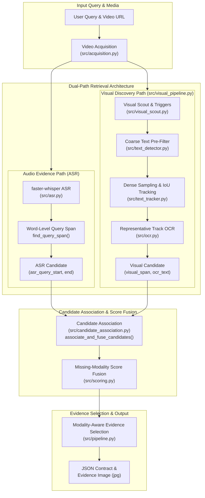
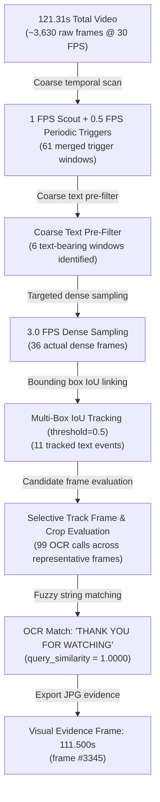
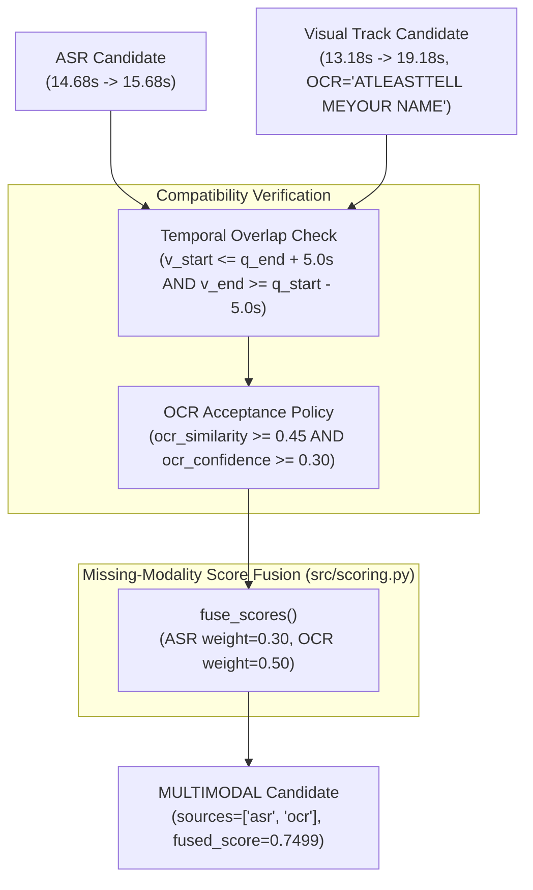
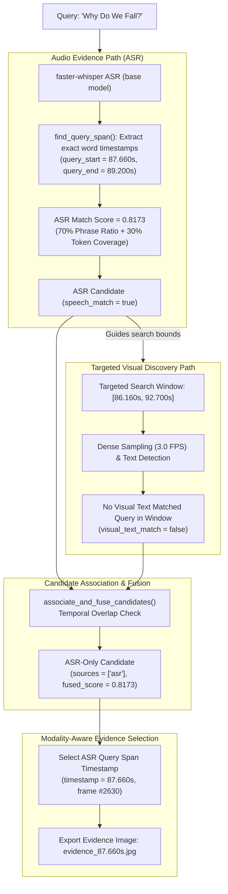
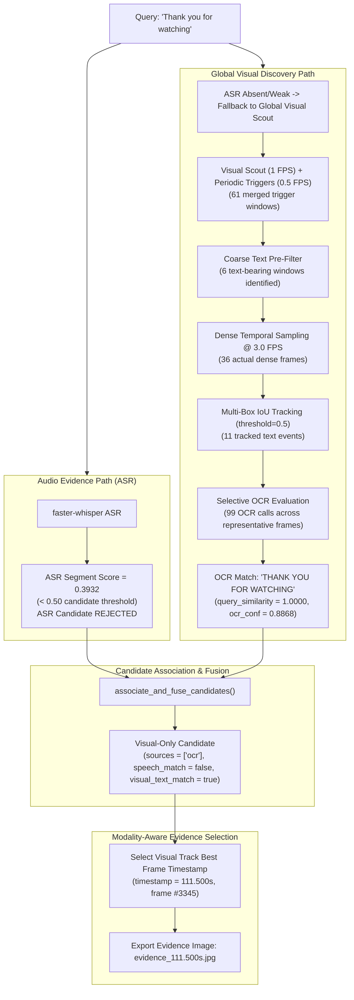
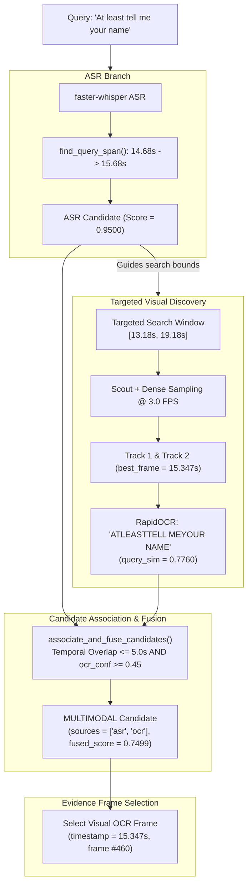
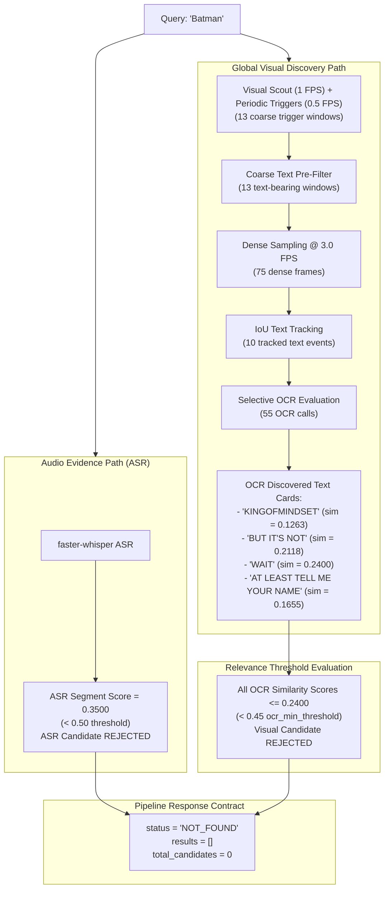

# System Architecture — Dual-Path Video Dialogue Locator (v1.0.0)

This document serves as the **authoritative deep technical architecture guide** for the **Video Dialogue Locator (v1.0.0 Baseline)**.

---

## 🏗️ High-Level Architectural Subsystems



---

## 1. Stage 1 — Video Acquisition (`src/acquisition.py`)
- Downloads media stream via `yt-dlp` into `input_video.mp4` (`merge_output_format: mp4`, `retries: 10`).
- Inspects OpenCV video metadata: duration (seconds), FPS (frames/sec), resolution ($W \times H$), and `has_audio` (boolean).

---

## 2. Stage 2 — Audio Evidence Path (`src/asr.py`)
- Transcribes audio using `faster-whisper` (`word_timestamps=True`, `beam_size=5`).
- Computes ASR segment score combining fuzzy phrase ratio (70%) and token coverage (30%) via `compute_asr_score()` in `src/matching.py`.
- If segment score $\ge 0.50$, executes `find_query_span(words, target_text)` to extract precise word-level timestamps (`asr_query_start`, `asr_query_end`).
- Establishes targeted visual search window:
  $$\text{TargetedWindow} = [\max(0, \text{asr\_query\_start} - 1.5\text{s}), \min(\text{duration}, \text{asr\_query\_end} + 3.5\text{s})]$$

### Case 5 ASR Word-Level Timestamp Example:
Query: `"At least tell me your name"`
```text
Word        Start    End
------------------------
"At"        14.68s -> 14.86s
"least"     14.86s -> 15.00s
"tell"      15.00s -> 15.24s
"me"        15.24s -> 15.38s
"your"      15.38s -> 15.50s
"name"      15.50s -> 15.68s
------------------------
ASR Query Span: 14.68s -> 15.68s
```

---

## 3. Stage 3 — Progressive Visual Search Reduction (`src/visual_pipeline.py`)

The visual path uses **Progressive Visual Search Reduction** to avoid running CPU-expensive text recognition across thousands of raw video frames:



### Stage Breakdown:
1. **Scout & Periodic Triggers (`src/visual_scout.py`)**: Computes frame difference triggers (1 FPS) and periodic safety triggers (0.5 FPS), merging adjacent triggers within `2.0s`.
2. **Coarse Text Pre-Filter (`src/text_detector.py`)**: Evaluates coarse scout frames with `TextDetector` to eliminate non-text regions (`Coarse text pre-filter: 6 text-bearing windows identified`).
3. **Dense Sampling (`src/sampling.py`)**: Samples remaining text-active windows at `sampling.dense_fps` (3.0 FPS in `config.yaml`).
4. **IoU Tracking (`src/text_tracker.py`)**: Links detected bounding boxes across consecutive frames into `TextEvent` tracks using Intersection over Union (`iou_threshold: 0.5`, `max_gap_seconds: 0.5`).
5. **Representative Track OCR (`src/ocr.py`)**: Samples candidate frames across track duration, runs OCR recognition, and dynamically sets `best_frame_timestamp` to the frame with the highest query similarity.

---

## 4. Stage 4 — Multi-Metric Candidate Association & Fusion (`src/candidate_association.py`)

Merges ASR query spans with visual track candidate spans using temporal compatibility AND multi-factor OCR evaluation:



---

## 5. Stage 5 — Modality-Aware Evidence Selection (`src/pipeline.py`)

The pipeline chooses the final evidence timestamp and image path based on candidate sources:

- **Multimodal (`sources = ["asr", "ocr"]`)**: Selects the visual OCR frame timestamp (`visual_span.best_frame_timestamp` = `15.347s`).
- **OCR-Only (`sources = ["ocr"]`)**: Selects the visual OCR frame timestamp (`visual_span.best_frame_timestamp` = `111.500s`).
- **ASR-Only (`sources = ["asr"]`)**: Selects the ASR query start timestamp (`asr_span.query_start` = `87.660s`).

---

## 🚶 Comprehensive Modality Pipeline Walkthroughs

### 1. Spoken-Only Dialogue Pipeline (Case 1 / 2 / 4)



- **Query**: `"Why Do We Fall?"` (Case 1)
- **Audio Path**: `faster-whisper` transcribes audio and `find_query_span()` isolates the query word timestamps: `query_start = 87.660s`, `query_end = 89.200s` (ASR score = `0.8173`).
- **Visual Path**: Targeted visual window `[86.160s, 92.700s]` is sampled at 3.0 FPS. No visual text matching the query is found (`visual_text_match = false`).
- **Association**: `associate_and_fuse_candidates()` classifies candidate as Spoken-Only (`sources = ["asr"]`).
- **Evidence Selection**: Modality evidence logic selects `asr_span.query_start` timestamp (`87.660s`, frame #2630) and exports `outputs/runtime/evidence_87.660s.jpg`.

---

### 2. Silent Visual Text Pipeline (Case 3)



- **Query**: `"Thank you for watching"` (Case 3)
- **Audio Path**: Segment score = `0.3932` ($< 0.50$), ASR candidate is rejected.
- **Visual Path**: ASR candidate is absent $\rightarrow$ pipeline falls back to global visual scout (`0.0s` to `121.31s`).
  - **Coarse Scout**: 61 merged trigger windows.
  - **Coarse Text Pre-Filter**: Identifies 6 text-bearing windows.
  - **Dense Sampling**: 36 actual dense frames @ 3.0 FPS.
  - **IoU Tracking**: 11 tracked text events.
  - **Selective OCR**: 99 OCR calls across candidate track frames. Track 11 yields `"THANK YOU FOR WATCHING"` (query similarity = `1.0000`, OCR confidence = `0.8868`).
- **Association**: `associate_and_fuse_candidates()` classifies candidate as Visual-Only (`sources = ["ocr"]`).
- **Evidence Selection**: Modality evidence logic selects `visual_span.best_frame_timestamp` (`111.500s`, frame #3345) and exports `outputs/runtime/evidence_111.500s.jpg`.

---

### 3. Multimodal Pipeline — Spoken + Visual Text (Case 5)



- **Query**: `"At least tell me your name"` (Case 5)
- **Audio Path**: ASR detects spoken segment at `14.68s -> 15.68s` (ASR score = `0.95`).
- **Visual Path**: ASR candidate guides visual discovery to targeted window `[13.18s, 19.18s]`. 19 dense frames are sampled @ 3.0 FPS. Text detector and IoU tracker form 3 tracks. Stage 5 representative OCR evaluates candidate frames across tracks and selects `15.347s` (`"ATLEASTTELL MEYOUR NAME"`, query similarity = `0.7760`, OCR confidence = `0.827`).
- **Association**: `associate_and_fuse_candidates()` links ASR query span and visual track span (temporal diff = `0.667s` $\le 5.0\text{s}$, OCR sim = `0.7760` $\ge 0.45$), yielding a Multimodal candidate (`sources = ["asr", "ocr"]`, `fused_score = 0.7499`).
- **Evidence Selection**: Modality evidence logic selects `visual_span.best_frame_timestamp` (`15.347s`, frame #460) and exports `outputs/runtime/evidence_15.347s.jpg`.

---

### 4. Negative Control Pipeline — `NOT_FOUND` (Case 6 / 7)



- **Query**: `"Batman"` (Case 6)
- **Audio Path**: Whisper ASR segment score = `0.3500` ($< 0.50$), ASR candidate is rejected.
- **Visual Path**: Global visual scout scans video. OCR extracts discovered text cards (`"KINGOFMINDSET"`, `"BUT IT'S NOT"`, `"WAIT"`, `"AT LEAST TELL ME YOUR NAME"`). Fuzzy similarity matching yields max query similarity = `0.2400` ($< 0.45\text{ threshold}$). Visual candidate is rejected.
- **Association**: Zero valid candidates survive score threshold filtering.
- **Output**: `locate_dialogue_in_video()` returns `status = "NOT_FOUND"`, `results = []`, `total_candidates = 0`.

