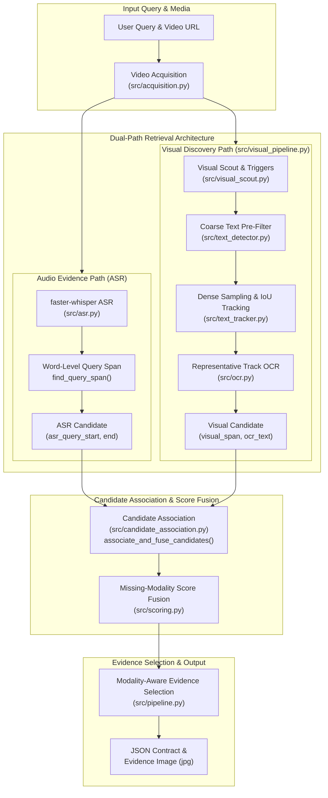
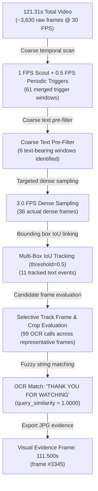
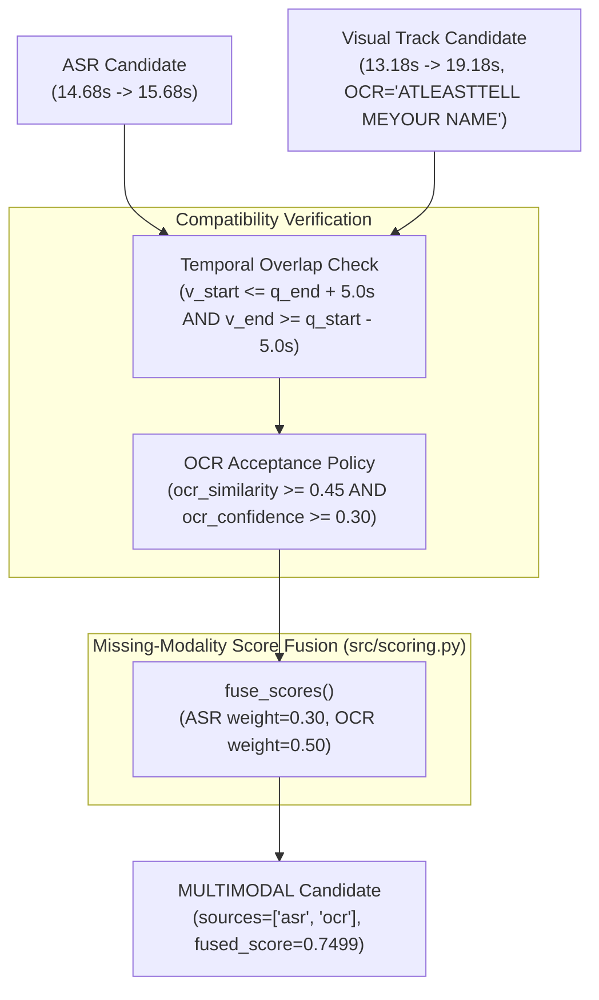

# System Architecture — Dual-Path Video Dialogue Locator (v1.0.0)

This document serves as the **authoritative deep technical architecture guide** for the **Video Dialogue Locator (v1.0.0 Baseline)**.

---

## 🏗️ High-Level Architectural Subsystems



---

## 1. Stage 1 — Video Acquisition (`src/acquisition.py`)
- Downloads media stream via `yt-dlp` into `input_video.mp4` (`merge_output_format: mp4`, `retries: 10`).
- Inspects OpenCV video metadata: duration (seconds), FPS (frames/sec), resolution ($W \times H$), and `has_audio` (boolean).

---

## 2. Stage 2 — Audio Evidence Path (`src/asr.py`)
- Transcribes audio using `faster-whisper` (`word_timestamps=True`, `beam_size=5`).
- Computes ASR segment score combining fuzzy phrase ratio (70%) and token coverage (30%) via `compute_asr_score()` in `src/matching.py`.
- If segment score $\ge 0.50$, executes `find_query_span(words, target_text)` to extract precise word-level timestamps (`asr_query_start`, `asr_query_end`).
- Establishes targeted visual search window:
  $$\text{TargetedWindow} = [\max(0, \text{asr\_query\_start} - 1.5\text{s}), \min(\text{duration}, \text{asr\_query\_end} + 3.5\text{s})]$$

### Case 5 ASR Word-Level Timestamp Example:
Query: `"At least tell me your name"`
```text
Word        Start    End
------------------------
"At"        14.68s -> 14.86s
"least"     14.86s -> 15.00s
"tell"      15.00s -> 15.24s
"me"        15.24s -> 15.38s
"your"      15.38s -> 15.50s
"name"      15.50s -> 15.68s
------------------------
ASR Query Span: 14.68s -> 15.68s
```

---

## 3. Stage 3 — Progressive Visual Search Reduction (`src/visual_pipeline.py`)

The visual path uses **Progressive Visual Search Reduction** to avoid running CPU-expensive text recognition across thousands of raw video frames:



### Stage Breakdown:
1. **Scout & Periodic Triggers (`src/visual_scout.py`)**: Computes frame difference triggers (1 FPS) and periodic safety triggers (0.5 FPS), merging adjacent triggers within `2.0s`.
2. **Coarse Text Pre-Filter (`src/text_detector.py`)**: Evaluates coarse scout frames with `TextDetector` to eliminate non-text regions (`Coarse text pre-filter: 6 text-bearing windows identified`).
3. **Dense Sampling (`src/sampling.py`)**: Samples remaining text-active windows at `sampling.dense_fps` (3.0 FPS in `config.yaml`).
4. **IoU Tracking (`src/text_tracker.py`)**: Links detected bounding boxes across consecutive frames into `TextEvent` tracks using Intersection over Union (`iou_threshold: 0.5`, `max_gap_seconds: 0.5`).
5. **Representative Track OCR (`src/ocr.py`)**: Samples candidate frames across track duration, runs OCR recognition, and dynamically sets `best_frame_timestamp` to the frame with the highest query similarity.

---

## 4. Stage 4 — Multi-Metric Candidate Association & Fusion (`src/candidate_association.py`)

Merges ASR query spans with visual track candidate spans using temporal compatibility AND multi-factor OCR evaluation:



---

## 5. Stage 5 — Modality-Aware Evidence Selection (`src/pipeline.py`)

The pipeline chooses the final evidence timestamp and image path based on candidate sources:

- **Multimodal (`sources = ["asr", "ocr"]`)**: Selects the visual OCR frame timestamp (`visual_span.best_frame_timestamp` = `15.347s`).
- **OCR-Only (`sources = ["ocr"]`)**: Selects the visual OCR frame timestamp (`visual_span.best_frame_timestamp` = `111.500s`).
- **ASR-Only (`sources = ["asr"]`)**: Selects the ASR query start timestamp (`asr_span.query_start` = `87.660s`).

---

## 🚶 Comprehensive Walkthrough Examples

### Walkthrough 1: Case 5 — Multimodal Match (Spoken + Visual)
- **Query**: `"At least tell me your name"`
- **ASR**: Word span detected at `14.68s -> 15.68s` (score = 0.95).
- **Visual**: Targeted search window `13.18s -> 19.18s`, 19 dense frames @ 3.0 FPS, Track 1 best frame = `15.347s` (`"ATLEASTTELL MEYOUR NAME"`, OCR confidence = 0.827, query sim = 0.776).
- **Association**: Temporal diff = 0.667s ($\le 5.0\text{s}$), OCR sim = 0.776 ($\ge 0.45$).
- **Output**: `status = "FOUND"`, `sources = ["asr", "ocr"]`, `timestamp = "00:00:15.347"`, frame #460.

### Walkthrough 2: Case 3 — Visual-Only Match (Silent Text)
- **Query**: `"Thank you for watching"`
- **ASR**: Segment score = 0.3932 ($< 0.50$), ASR candidate rejected.
- **Visual**: Global visual scout `0.0s -> 121.31s`, 61 coarse windows $\rightarrow$ 6 text-bearing windows $\rightarrow$ 36 dense frames $\rightarrow$ 11 tracks $\rightarrow$ 99 OCR calls. Track 11 best frame = `111.500s` (`"THANK YOU FOR WATCHING"`, query sim = 1.0000).
- **Association**: Visual-only match (`speech_match = false`, `visual_text_match = true`).
- **Output**: `status = "FOUND"`, `sources = ["ocr"]`, `timestamp = "00:01:51.500"`, frame #3345.

### Walkthrough 3: Case 6 — Negative Control (`NOT_FOUND`)
- **Query**: `"Batman"`
- **ASR**: Segment score = 0.3500 ($< 0.50$), ASR candidate rejected.
- **Visual**: Global visual scout, OCR recognizes text (`"KINGOFMINDSET"`, `"BUT IT'S NOT"`, `"WAIT"`, etc.), all query similarities $\le 0.24$.
- **Association**: No candidate meets similarity threshold.
- **Output**: `status = "NOT_FOUND"`, `results = []`.
