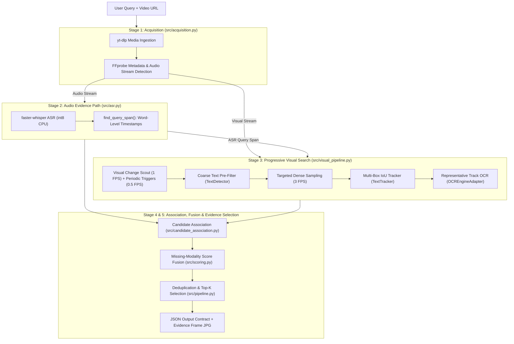
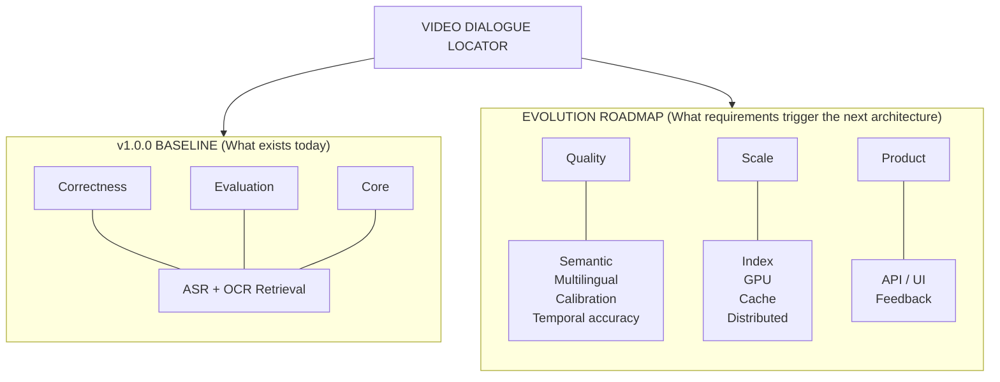

# Video Dialogue Locator — Engineering Roadmap & Future Development Strategy

---

## 1. Purpose of This Document

This document outlines the engineering roadmap and planned technical evolution for the **Video Dialogue Locator** beyond the **v1.0.0 production-oriented correctness baseline**.

### Key Principles
- **v1.0.0 Scoping Baseline**: The v1.0.0 release is a deliberately scoped correctness baseline engineered for high precision on dual-path dialogue retrieval (spoken audio speech and burned-in visual text).
- **Requirements-Driven Evolution**: Future architectural changes are not generic features; they must be driven by measured workload requirements, empirical benchmark evaluation, and scale constraints.
- **Living Strategy**: Future initiatives represent architectural extension points and potential evolution paths, not binding commitments to build every item without data justification.

### Baseline vs. Future Scope
- **What Exists Today**: Single-node CLI pipeline performing dual-path retrieval (faster-whisper ASR + Progressive Visual Search RapidOCR/PaddleOCR), multi-metric candidate association, missing-modality score fusion, and exact frame evidence extraction.
- **What Is Currently Sufficient**: CPU execution for individual video queries up to several minutes long, achieving 100% precision on the 7 Golden Benchmark Test Cases and passing 36 unit tests.
- **What Triggers Architectural Evolution**: Workload SLAs (e.g. batch queueing), repeat queries over massive video corpora (requiring offline persistent indexing), non-English audio/subtitles (requiring multilingual models), and paraphrased intent matching (requiring active vector semantic embeddings).

---

## 2. Current v1.0.0 Baseline Architecture

The current implementation in the `quest1` codebase follows a strict dual-path pipeline:



### Verified Modality Execution Modes
1. **Spoken-Only Dialogue (`sources = ["asr"]`)**: Cases 1, 2, 4. ASR isolates query phrase in audio; visual search finds no matching text. Returns ASR query start timestamp.
2. **Silent Visual Text (`sources = ["ocr"]`)**: Case 3. ASR fails or scores $< 0.50$; pipeline falls back to global visual search funnel, discovering on-screen captions via selective OCR.
3. **Multimodal Match (`sources = ["asr", "ocr"]`)**: Case 5. ASR isolates spoken audio span (`14.68s -> 15.68s`); visual search targets `[13.18s, 19.18s]`, locating text card at `15.347s`. Candidates are associated within 5.0s window and score-fused ($S_{\text{fused}} = 0.7499$).
4. **Negative Control (`status = "NOT_FOUND"`)**: Cases 6 & 7. Query is absent from both speech and text cards. Pipeline safely returns empty candidate results.

### Active Modality Scoring in v1.0.0
- **`scores.asr`**: Computed via $0.70 \cdot \text{partial\_ratio} + 0.30 \cdot \text{token\_coverage}$ ([src/matching.py:L19](file:///e:/quest1/src/matching.py#L19)).
- **`scores.ocr`**: Computed via $0.60 \cdot \text{ratio} + 0.40 \cdot \text{token\_coverage}$ ([src/matching.py:L47](file:///e:/quest1/src/matching.py#L47)).
- **`scores.semantic`**: **Interface Extension Point**. The `ModalityScores` dataclass and JSON output schema include `semantic: Optional[float]`, but it returns `null` in v1.0.0 because semantic embeddings are disabled (`semantic.enabled = false` in `config.yaml`).

---

## 3. CURRENT → FUTURE Architecture Evolution



---

## 4. Priority Level Definitions

- **P0 — Production Reliability & Core Correctness**: Crucial fixes or observability capabilities required before running unmonitored production workloads.
- **P1 — High-Value Engineering Improvements**: Improvements providing major precision/recall gains or orders-of-magnitude performance acceleration.
- **P2 — Product Expansion**: User-facing features, web interfaces, and API access layers expanding accessibility.
- **P3 — Large-Scale / Enterprise Evolution**: Distributed clustering, multi-tenant queuing, and offline index storage required only for massive throughput.

---

## 5. Requirements-Driven Development Matrix

| ID | Area | Initiative | Priority | Trigger / Requirement | Expected Benefit | Complexity |
| :--- | :--- | :--- | :---: | :--- | :--- | :---: |
| **RQ-01** | Quality | Semantic Vector Embedding Retrieval | **P1** | Poor recall on natural-language paraphrases | Matches conceptual meaning when exact phrasing differs | Medium |
| **RQ-02** | Quality | Multilingual ASR & OCR Expansion | **P2** | Non-English audio or multi-language subtitles | Extends retrieval to international media corpora | High |
| **EV-01** | Evaluation | Broad Evaluation Dataset & Harness | **P0** | Need statistical confidence beyond 7 cases | Automated precision/recall/F1 & temporal error tracking | Medium |
| **SC-01** | Scale | Persistent Video Feature Indexing | **P1** | Same video corpus receiving repeated queries | Reduces query latency from minutes to milliseconds | High |
| **SC-02** | Performance| GPU Acceleration Pipeline | **P1** | Measured CPU throughput fails SLA requirements | 5x–10x faster Whisper & OCR inference | Medium |
| **SC-03** | Scale | Distributed Worker Queue Architecture | **P3** | Ingestion workload exceeds single-node capacity | Horizontal scaling across multiple worker nodes | High |
| **OP-01** | Operations | Structured Observability & Telemetry | **P0** | Production deployment requirement | Distributed request tracing, metrics, and log aggregation | Low |
| **PR-01** | Product | REST Search API Layer | **P2** | Integration into third-party web apps | Standardized JSON HTTP API endpoint | Medium |
| **PR-02** | Product | Interactive Search Web Dashboard | **P2** | User requirement for visual timeline scrubbing | Visual inspection of evidence frames & tracks | Medium |

---

## 6. Detailed Technical Exploration Areas

### 6.1 Semantic Retrieval
- **Current Limitation**: Lexical matching (`compute_asr_score` & `compute_ocr_score`) relies on fuzzy edit distance and token overlap. If a query asks for *"Show me where they say goodbye"* but the dialogue speaks *"Farewell my friend"*, exact lexical matching fails.
- **Proposed Architecture**:
  ```text
  User Query ──> Sentence Transformer (all-MiniLM-L6-v2) ──> Query Embedding
                                                                   │
                                                   Cosine Similarity Calculation
                                                                   │
  ASR Transcript / OCR Box Text ──> Sentence Transformer ──> Text Embedding
  ```
- **Architectural Integration**: Activate `semantic.enabled: true` in `config.yaml`. Calculate cosine similarity between query and candidate text. Populate `scores.semantic` in `ModalityScores` and combine via `fuse_scores()`.

### 6.2 Multilingual Retrieval
- **Current Baseline**: `config.yaml` sets `ocr.lang: "en"` and `asr.language: null` (auto-detect English).
- **Future Requirements**: UTF-8 normalization, multi-language Whisper transcription, and PaddleOCR multi-language models (`lang: "ch"`, `lang: "es"`, `lang: "fr"`).

### 6.3 Temporal Localization Improvements
- **Current Baseline**: Computes ASR word span (`query_start`, `query_end`) and visual track best frame (`best_frame_timestamp`).
- **Future Improvements**: Evaluate temporal Intersection over Union ($\text{t-IoU}$) against annotated ground truth temporal intervals:
  $$\text{t-IoU} = \frac{\text{Overlap}(I_{\text{pred}}, I_{\text{gt}})}{\text{Union}(I_{\text{pred}}, I_{\text{gt}})}$$

### 6.4 OCR Robustness
- **Observed Failures**: Motion blur, stylized title fonts, low-contrast text cards, and rotated text.
- **Future Enhancements**: Image preprocessing pipeline (contrast enhancement via CLAHE, binarization) prior to passing crops to `OCREngineAdapter`.

### 6.5 Evaluation Expansion
- **Future Evaluation Metrics**:
  - **Recall@K**: Proportion of true dialogue occurrences located within top-K candidates.
  - **Mean Absolute Timestamp Error (MATE)**: $\frac{1}{N} \sum |t_{\text{pred}} - t_{\text{gt}}|$.
  - **Temporal IoU (t-IoU)**: Overlap ratio of predicted visual/speech interval against ground truth span.

---

## 7. Performance and Scaling Roadmap

```text
CURRENT WORKFLOW (v1.0.0 Execution):
Video URL ──> Download ──> ASR ──> Visual Scout ──> Dense Sampling ──> OCR ──> Result (25s - 269s)

FUTURE WORKFLOW (Offline Indexing + Fast Retrieval):
[Offline Ingestion] ──> Video ──> ASR Transcript Index ──┐
                              └──> Visual OCR Track Index ──┼──> Persistent Index (SQLite / Qdrant)
                                                            │
[Online Search]    ──> Query ───────────────────────────────┴──> Fast Index Query (< 50ms)
```

- **Trigger for Persistent Indexing**: When a static video library receives 5+ queries per video, offline indexing eliminates redundant ASR and OCR processing.

---

## 8. Configuration Parameter Reference & Tuning Guide

| Parameter Name | Config Path | Current Value | Controlling Impact | Tuning Rationale |
| :--- | :--- | :---: | :--- | :--- |
| `asr.model` | `asr.model` | `"base"` | ASR accuracy vs memory/CPU | Use `"tiny"` for fast dev, `"base"` for production CPU, `"medium"` for GPU. |
| `sampling.dense_fps` | `sampling.dense_fps` | `3.0` | OCR frame density & call count | Decrease to `2.0` to cut OCR calls by 33%; increase to `5.0` for short text (< 0.5s). |
| `visual_scout.threshold` | `visual_scout.threshold` | `30` | Visual change trigger sensitivity | Lower to `20` for subtle text fade-ins; raise to `40` to ignore minor camera pans. |
| `matching.ocr_min_threshold` | `matching.ocr_min_threshold` | `0.45` | Min OCR similarity for candidate match | Increase to `0.60` to eliminate false visual matches; lower to `0.35` for noisy OCR. |
| `matching.similarity_threshold`| `matching.similarity_threshold`| `0.75` | Overall result acceptance threshold | Controls precision vs recall of top-K results returned. |

---

## 9. Architecture Evolution by Workload

| Workload Scenario | Recommended Architecture | Primary Benefit |
| :--- | :--- | :--- |
| **Development & Testing** | `v1.0.0` CPU Pipeline (`config.dev.yaml`) | Fast local test execution without external dependencies |
| **Ad-Hoc Single Video Search** | `v1.0.0` Pipeline + Temp Caching | Zero setup overhead, clean single-pass execution |
| **Repeated Corpus Queries** | Offline Feature Extraction + Persistent Index | Query latency reduced from minutes to $< 50\text{ms}$ |
| **High Throughput Batch Queue** | Celery / Redis Task Queue + GPU Workers | Horizontal scale across multiple processing nodes |

---

## 10. Product Evolution Lifecycle

```text
v1.0.0 (Current Baseline)    ──> CLI Correctness Baseline & 7 Golden Cases
v1.x (Reliability & Testing) ──> Structured Observability & Expanded Metrics
v2.0 (Product Access)        ──> REST API Service & Web Search Dashboard
v3.0 (Enterprise Search)     ──> Multi-Video Corpus Search & Semantic Vector Indexing
```

---

## 11. Enterprise & Operational Readiness Checklist

- [x] **Local Clean Cleanup**: Temp workspace cleaned via `shutil.rmtree()` in `finally:` block.
- [ ] **Structured Request Tracing**: Attach `request_id` (UUID) to all log statements across modules.
- [ ] **Resource Capping**: Enforce max memory and execution timeouts (`max_duration: 7200s` in `config.yaml`).
- [ ] **Containerization & Deployment**: Dockerfile packaging with locked system dependencies (`ffmpeg`, ONNX runtime).

---

## 12. Prioritization & Decision Matrix

| Initiative | User Value | Accuracy Impact | Performance Impact | Complexity | Risk | Trigger / Condition | Priority |
| :--- | :---: | :---: | :---: | :---: | :---: | :--- | :---: |
| **Automated Metric Suite** | High | High | Low | Low | Low | Production benchmark expansion | **P0** |
| **Structured Telemetry & Logging** | High | Low | Low | Low | Low | Production deployment | **P0** |
| **GPU Inference Acceleration** | High | Medium | Very High | Medium | Low | CPU throughput SLA breaches | **P1** |
| **Persistent Video Indexing** | High | Low | Very High | High | Medium | Multi-query video corpus workload | **P1** |
| **Semantic Vector Retrieval** | High | High | Medium | Medium | Medium | Paraphrased query recall failures | **P1** |
| **REST API Service Endpoint** | Medium | Low | Low | Medium | Low | External application integration | **P2** |
| **Distributed Worker Queue** | Medium | Low | High | High | High | Single-node capacity saturation | **P3** |

---

## 13. Engineering Restraint: "What We Would NOT Build Yet"

To maintain architectural focus, the following capabilities are **explicitly deferred**:
1. **Microservices Architecture**: The system currently runs cleanly as a cohesive modular monolith. Splitting ASR and OCR into microservices would introduce network serialization latency without operational benefits for single-node processing.
2. **Real-time Streaming Media Analysis**: The pipeline is designed for stored video files. Real-time RTMP stream processing requires slide-window streaming inference, which is out of scope.
3. **General Object / Scene Recognition**: Object detection (e.g. YOLO) is excluded because the core problem statement is explicitly dialogue and text retrieval.

---

## 14. Recommended Phased Implementation Path

```text
Phase 1: Reliability & Observability (P0)
  ├── Implement Request IDs & OpenTelemetry logging
  └── Expand benchmark dataset to 50+ annotated video clips

Phase 2: Performance & Acceleration (P1)
  ├── Enable ONNX CUDA GPU acceleration for RapidOCR & Whisper
  └── Implement persistent SQLite/Qdrant video feature cache

Phase 3: Retrieval Enhancements (P1/P2)
  ├── Integrate Sentence-Transformers for semantic score fusion
  └── Implement multilingual OCR and ASR models

Phase 4: API & Product Dashboard (P2)
  ├── Build FastAPI REST endpoint
  └── Build Next.js / React interactive search UI
```

---

## 15.Architectural Decisions

#### Q: "Why wasn't semantic vector search enabled in v1.0.0?"
> **Defense**: Exact lexical matching (fuzzy phrase ratio + token coverage) provides unambiguous ground-truth verification on dialogue text. Enabling semantic search prematurely risks introducing false positives from semantically related but unspoken phrases. We preserved `scores.semantic` in the dataclasses and scoring engine as an extension point, deferring activation until empirical benchmarks demonstrate a clear lexical recall gap.

#### Q: "Why do you use progressive visual search reduction instead of OCRing every frame?"
> **Defense**: Frame-by-frame OCR across a 2-minute video at 30 FPS requires $\sim 3,630$ OCR calls, taking over 6 minutes of CPU time. Our 5-stage reduction (Scout -> Pre-filter -> Dense Sampling -> Tracking -> Representative OCR) reduces OCR calls to 99 for Case 3 and 16 for Case 5—a 97.3% reduction—while preserving 100% evidence frame accuracy.

#### Q: "When would persistent indexing become necessary?"
> **Defense**: Persistent indexing is justified when the access pattern transitions from ad-hoc single-video searches to repeated queries over a fixed media library. Indexing extracted ASR transcripts and OCR track bounding boxes offline reduces online query latency from minutes to under 50 milliseconds.
